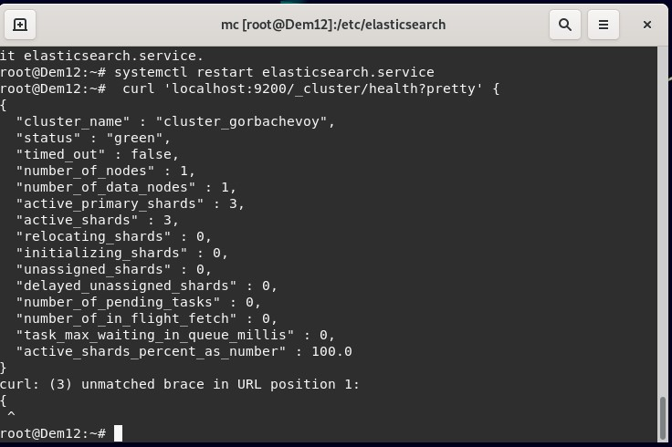

# Домашнее задание к занятию 11.3 "ELK" - `Горбачев Олег`

### Задание 1. Elasticsearch.
Установите и запустите elasticsearch, после чего поменяйте параметр cluster_name на случайный.

Приведите скриншот команды 'curl -X GET 'localhost:9200/_cluster/health?pretty', сделанной на сервере с установленным elasticsearch. Где будет виден нестандартный cluster_name
### Ответ:
*выполняем обновление и устанавливаем зависимости*
```shell
apt update && apt install gnupg apt-transport-https
```
*добавляем gpg-ключ*
```shell
wget -qO - https://artifacts.elastic.co/GPG-KEY-elasticsearch | sudo apt-key add 
```
*добавляем репозиторий в apt*
```shell
echo "deb [trusted=yes] https://mirror.yandex.ru/mirrors/elastic/7/ stable main" | sudo tee /etc/apt/sources.list.d/elastic-7.x.list
```
*устанавливаем elastic*
```shell
apt update && apt-get install elasticsearch
```
*обновляем конфиги systemd*
```shell
systemctl daemon-reload 
```
*включаем юнит*
```shell
systemctl enable elasticsearch.service  
```
*запускаем сервис*
```shell
systemctl start elasticsearch.service  
```
*менякм cluster_name*
```shell
nano /etc/elasticsearch/elasticsearch.yml
```
*перезапускаем сервис*
```shell
systemctl restart elasticsearch.service  
```
*проверяем*
```shell
curl 'localhost:9200/_cluster/health?pretty' {  
```


---

### Задание 2. Kibana.
Установите и запустите kibana.
Приведите скриншот интерфейса kibana на странице http://<ip вашего сервера>:5601/app/dev_tools#/console, где будет выполнен запрос GET /_cluster/health?pretty
### Ответ:

---
### Задание 3. Logstash.
Установить и запустить Logstash и Nginx. С помощью Logstash отправить access-лог nginx в Elasticsearch.
Приведите скриншот интерфейса kibana, на котором видны логи nginx.
### Ответ:

---

### Задание 4. Filebeat.
Установить и запустить Filebeat. Переключить поставку логов Nginx с Logstash на Filebeat.
Приведите скриншот интерфейса kibana, на котором видны логи nginx, которые были отправлены через Filebeat.
### Ответ:

---
